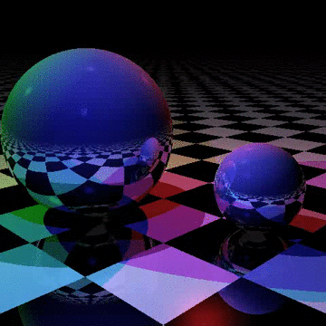

# Assignment 1:  Distribution Ray Tracing 

The code included in the assignment is a basic ray tracer, largely taken from the Typescript [samples](https://github.com/Microsoft/TypeScriptSamples) on github.com. It has been extended to render the frames incrementally (line by line) so that the frames are displayed as they are rendering, to allow the rendering resolution to be different than the canvas size, and to render multiple frames into a video with the Whammy client-side WebM video encoder (https://github.com/antimatter15/whammy).  The project creates a video like this:



**IMPORTANT**:  the Whammy library does not work in all web browsers (e.g., we had problems with Safari and Firefox).  We recommend you use Chrome for this assignment. 

The goal of this assigment is to extend this simple raytracer to support distribution ray tracing, specifically two improvements (antialiasing and motion blur) that make better looking videos.  You should read the introduction to Chapter 13 and section 13.4 in your textbook to prepare for the assignment.

## Due: Friday September 11th, 5pm

## Overview 

You will implement two specific uses of distribution ray tracing:

1. *Antialiasing from jittered supersampling*, described in 13.4.1.  You should implement a NxN grid of sample bins, and select a random point to sample from each bin. The N*N colors should be averaged to get the final color for each pixel.
2. *Motion blur*, described in 13.4.5.  Each ray cast into the scene should have a random time in the video frame time interval associated with it, and that time should be used to compute all relevant properties of objects.

In addition, you should modify the sample code to have a more general camera model, one where the parameters that define the location and size of the viewport relative to the camera are explicitly passed in, not implicit in the computation (as they are now).  

Specifically, you should extend the Camera object to give direct control over the distance of the viewing plane from the camera position (the focal length) and the horizontal and vertical size of the viewing window. This will allow you to change the field of view of the camera, and change it independently in both the horizontal and vertical directions.  

All of your videos should be generated at 640x480, with the same vertical field of view as in the sample code. (If you tried to use the current code to generate a non-square video, the sphere's would be distorted).

## Details

The sample code has been extended to support creating a video from a sequence of frames, where the render() method accepts a video *length* (in seconds) and *fps* (frames per second), and uses those to compute the number of frames to be rendered.  When you are testing your code, you should take advantage of the fact you can change the length, number of frames and number of pixels in the video. Low resolution, low frames-per-second videos can help you test parts of your code quickly, before rendering high resolution, high frame-rate movies.

#### Camera

The Camera object's constructor should have new parameters added for distance, horizonal size and vertical size:
```js
constructor(public pos: Vector, lookAt: Vector, distance: number, hsize: number, vsize: number)
```
These values should be provided in world coordinates. You should add the necessary state to the object (whatever values you need to implement the more general camera in the ```getPoint()``` method).

#### Antialiasing

The changes necessary for the implementing antialiasing will all be in the ```render()``` method. You should add a ```grid: number``` parameter to ```render()``` For each pixel, you should generate ```grid * grid```  rays using jittered points within each bin, cast them into the scene and use the average of the resulting colors as the color for the pixel.  

#### Motion blur

To implement motion blur, you will need to update the ```intersect()``` method of the ```Thing``` class to include a ```time: number``` parameter (there are other changes you will need to make to the code, many of them to get the time value down to where ```intersect()``` is called, but this is the key change). 

For each ray that you shoot into the scene, you should sample a random time in the time interval corresponding to the current frame.  For example, you are generating a video that has 10 frames per second, the 1st frame covers the time interval (0, 0.1), the second (0.1, 0.2), and so on, and pass that time value to ```traceRay()```.

You will need to update the ```intersect()``` methods of the subclasses of ```Thing``` to take time into account:  the Plane object can ignore Time for this assignment.  The Sphere object should have a new method added to compute the center of the sphere at a given time: 
```js
getCenter(time: number): Vector 
```
The current Sphere will just return the center vector. You should implement a new ```Sphere``` called ```MovingSphere``` that overrides the ```getCenter()``` method to compute the center of a moving sphere.

You should call this method to determine the center of the Sphere whenever it is needed.  

**IMPORTANT**:  the sample program has code to move the sphere embedded in the render() method. When you create the MovingSphere, you should move all of this code into the ```computeCenter``` method, and remove it from render.  

## Submission

Your grade will be based on satisfying the requirement described above.  You should submit your code in a clean zip file, as in the first assignment

You will also submit four movies.  The movies should be 640x480 resolution, 2 seconds long, with a frame rate of 10 fps.  The movies should be:

1. Movie of the same sample scene created by the sample code, but rendered at 640x480 with the fixed Camera specification.  The center part of the movie should be the same as the movie generated by the sample code.
2. The same movie as 1., with the addition of antialiasing.
3. The same movie as 2., with the addition of motion blur.
4. Change the scene in some non-trivial ways (e.g., at least change change the light color and positions, and the positions and attributes of the objects in the scene).  You are free to add new kinds of motions, or make other changes that interest you, but that is not required.

Each movie should be an MP4 file, so it is easy for the TAs to view.  You should download the .webm movie (be sure to name it with the .webm suffix) and convert to an .mp4 of the same resolution.  We had success and using the web service at http://video.online-convert.com/convert-to-mp4. (There are also software packages you can download for different platforms.) Please make sure to create a file of the same size and framerate as your .webm movie.

**Do Not Change the names** of raytracer.html and raytracer.ts.  The TAs need to be able to test your program as follows:

1. cd into the directory and run ```npm install```
2. compile with ```tsc```
3. open and view the web page ```raytracer.html```

The TAs will need to change the parameters you pass to the ```render()``` function and generate images to test various aspects of your code, especially that the generalized Camera model works correctly.
